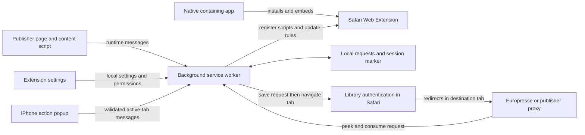
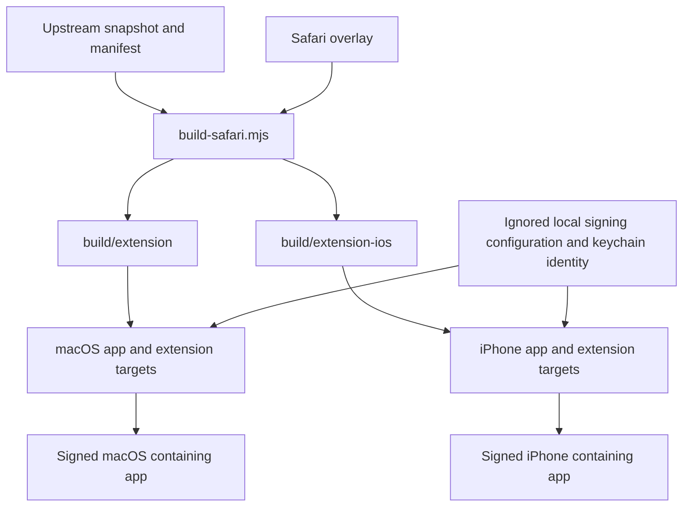
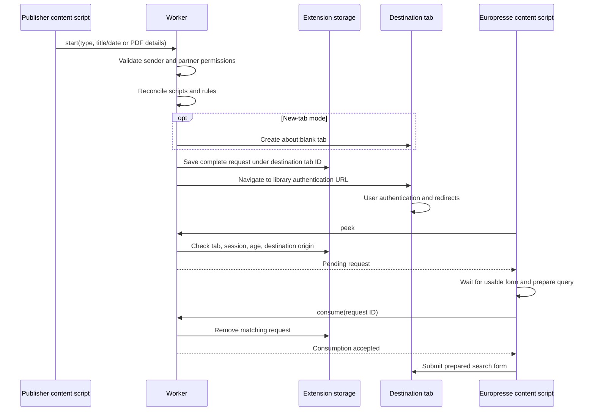

# Architecture

This document describes the implementation on `main`, including the macOS and iPhone ports. It distinguishes shipped behavior from retained upstream source and unverified workflows. Installation instructions are in [README.md](README.md); observed test results are in [safari/VALIDATION.md](safari/VALIDATION.md).

## 1. Purpose and system boundary

OphiroSafari is a Safari Web Extension packaged inside small native apps. On supported newspaper pages, it adds reading links that carry an article title, publication date, PDF edition, or publisher path through a library's authentication flow. The destination is Europresse or a supported BnF publisher proxy.

The reading workflow runs inside Safari. There is no project-operated backend, account service, remote configuration service, or runtime code updater. Library authentication, cookies, subscriptions, and article availability remain the responsibility of the external websites and Safari.

The native containing apps install the extension and provide onboarding. They do not execute searches or maintain a separate authenticated browser session.

## 2. Source layout and ownership

| Location | Role |
| --- | --- |
| [`ophirofox/`](ophirofox/) | Imported upstream MV3 extension: manifest, partner records, publisher adapters, styles, icons, and original settings UI. This is an intact reference snapshot, not the exact extension shipped to Safari. |
| [`safari/upstream.json`](safari/upstream.json) | Records upstream repository, branch, commit, and license. The imported commit is `364cedd74f916a116645f14ed2f1104de8381940`. |
| [`safari/extension/`](safari/extension/) | Shared Safari overrides and additions. Files at matching relative paths replace upstream files during generation. |
| [`scripts/build-safari.mjs`](scripts/build-safari.mjs) | Deterministic resource and manifest generation for macOS and iOS. |
| [`safari/Ophirofox Safari/`](<safari/Ophirofox Safari/>) | AppKit macOS app and Safari extension Xcode project. |
| [`safari/Ophirofox iOS/`](<safari/Ophirofox iOS/>) | UIKit iPhone app and Safari extension Xcode project. |
| [`safari/Ophirofox.xcworkspace/`](safari/Ophirofox.xcworkspace/) | Opens both native projects together. It does not combine their app targets or signing settings. |
| [`tests/`](tests/) | Node unit tests, a mocked extension-worker harness, and jsdom publisher/search/popup fixtures. |
| `build/` | Ignored generated extension resources, compiled products, and local diagnostic output. Never the source of record. |

The snapshot contains **143 partner configurations and 65 content-script groups**. Both platform builds retain those groups and records. The Safari build also adds the PressReader BnF proxy match to the relevant group.

The complete upstream files remain available even where their behavior has been replaced. For example, reading `ophirofox/background.js` describes upstream behavior; the shipped worker comes from `safari/extension/background.js`. Likewise, the retained upstream contribution/release helper files are not the Safari deployment pipeline.

## 3. Build and packaging architecture

### Extension generation

`npm run build` generates macOS resources in `build/extension`. `npm run build:ios` generates iPhone resources in `build/extension-ios`. Each generation:

1. Reads the upstream manifest and derives the selected platform's output path.
2. Recreates that output directory, copies the upstream extension, and applies the Safari overlay by relative path.
3. Copies the MPL-2.0 license and generates `partners.js`, containing `OPHIROFOX_PARTNERS` and `OPHIROFOX_ORIGINS`.
4. Removes `browser_specific_settings` and `options_ui.open_in_tab` from the generated manifest.
5. Sets one classic MV3 service worker, its permissions, and the platform's extension action.
6. Prepends shared metadata/core helpers to content-script groups that use `config.js`; adds the BnF helper to the four special-service groups.
7. Wraps publisher adapters in per-document guards and function scopes, preventing duplicate execution and top-level variable collisions.
8. Augments the upstream settings HTML with Safari guidance, status feedback, shared scripts, a viewport declaration, and responsive CSS.

The custom upstream manifest metadata is therefore an **input format**, not a runtime dependency. The partner catalogue is bundled code/data, not fetched from the internet when the extension starts.

### Native packaging

The checked-in Xcode projects reference generated resources. Apple's Safari extension tooling was used to create the scaffolds; it is not run on every build.

- [`build-macos.sh`](scripts/build-macos.sh) regenerates Mac resources, builds Debug for arm64, verifies signing, and retains one containing app at `build/Ophirofox Safari.app`. It removes the extra signed containing-app copy from the generated products directory to avoid duplicate Safari installations.
- [`build-ios.sh`](scripts/build-ios.sh) regenerates iOS resources and builds either a certificate-free simulator product or a signed device product. Device provisioning refresh/registration is opt-in through `OPHIROFOX_UPDATE_PROFILES=1`; ordinary updates reuse cached profiles.
- [`install-ios.sh`](scripts/install-ios.sh) verifies the device app, installs it with `devicectl`, and attempts launch. Installation and launch are separate operations; a locked phone can prevent launch after successful installation.

The current project targets are macOS 26 on Apple silicon and iOS 27 on iPhone. These are the supported project configurations, not claims about the earliest OS versions on which individual WebExtension APIs exist.

## 4. Runtime components

### Shared core and publisher adapters

[`core.js`](safari/extension/core.js) contains pure helpers shared by the worker and content scripts: settings normalization, title tokenization, date conversion, date-range selection, origin derivation/matching, and authentication-rule generation. It also exports a CommonJS module for Node tests.

Most publisher adapters and their CSS remain upstream code. They inspect publisher-specific DOM elements and call the familiar helper functions such as `ophirofoxEuropresseLink` and `ophirofoxEuropressePDFLink`.

The replacement [`config.js`](safari/extension/content_scripts/config.js) preserves that helper interface while changing its implementation. It loads local settings, creates anchors, handles ordinary/keyboard clicks and middle/modified clicks, and sends structured requests to the worker. The worker handles navigation; content scripts no longer rely on asynchronous `window.open` for these handoffs. Link errors appear on the publisher page.

The shared overlay additionally replaces the Europresse scripts and the four special-service adapters. [Le Parisien](safari/extension/content_scripts/le-parisien.js) has a dedicated override that observes nested DOM changes and restores one reading link after header replacement. A once-per-document wrapper alone would not address that site's dynamic updates.

### Background worker

[`background.js`](safari/extension/background.js) is the coordinator for both platforms. It:

- Loads the current partner and settings.
- Reconciles dynamic Europresse script registration, authentication rules, and the optional Mac context menu.
- Validates request senders, records pending work, and creates/updates destination tabs.
- Exposes the request protocol described below.
- Removes consumed, closed-tab, expired, and previous-session requests.

Worker messages and event-driven reconciliation run through one promise queue. This orders mutations within a worker instance and prevents two handlers from consuming the same record concurrently. Durable state lives in extension storage, not in the queue. This is not a database transaction spanning storage, tab navigation, and a remote website.

### Settings and native apps

The extension's settings page is the upstream French HTML transformed by the generator, with a replacement [controller](safari/extension/settings/options_ui.js) and additional [CSS](safari/extension/settings/safari.css). It filters the partner list, requests permissions through user interaction, persists preferences, and hides the desktop context-menu option on iOS. Changing partner derives the saved authentication URL from the newly selected partner.

The [Mac view controller](<safari/Ophirofox Safari/Ophirofox Safari/ViewController.swift>) loads bundled onboarding HTML in a WKWebView, reads Safari extension enablement state, and opens Safari extension preferences. Its small WKWebView message bridge handles the preferences button.

The [iPhone view controller](<safari/Ophirofox iOS/Ophirofox iOS/ViewController.swift>) uses UIKit and a scrollable WKWebView constrained to the screen/safe area. It displays bundled French setup instructions and opens user-activated HTTPS links externally. It does not claim to read extension enablement through the Mac-only onboarding implementation.

Both native extension handlers simply complete requests without returning payloads. There is no functional native-messaging bridge carrying article data, passwords, or searches between the WebExtension and the containing apps. The Mac onboarding button bridge is separate from WebExtension native messaging.

## 5. Request lifecycle and stored data

### Normal article flow

New-tab mode creates the blank tab first so its identifier is known. Storage is awaited **before** navigating that tab. If navigation fails, the worker removes its request record. One destination tab has one pending slot; independent tabs have independent requests, while a later request targeting the same tab replaces that slot.

### Storage model

| Storage/key | Contents | Lifetime |
| --- | --- | --- |
| `storage.local` / `ophirofox_settings` | JSON-serialized preferences and derived partner authentication URL. Defaults: BnF, same tab, no automatic single-result opening, no context menu. | Until changed or extension data is removed. The reader accepts an object or JSON string and falls back after malformed JSON. |
| `storage.local` / `safari.request.<tabId>` | Structured pending request. | Removed after consumption, failed navigation, tab closure, or cleanup. Maximum accepted age is 30 minutes. |
| `storage.session` / `ophirofox.browserSession` | Random browser-session marker. | Follows Safari's session-storage lifetime; survives worker recreation, but a reset invalidates previous requests. |

Each pending record includes `id`, `session`, `createdAt`, `loginAttempts`, `type`, `partner_name`, `authURL`, permitted destination `origins`, and `origin_url`. Type-specific fields are:

| Type | Additional data | Destination behavior |
| --- | --- | --- |
| `read` | `search_terms`, normalized `published_time` | Title search. |
| `SearchMenu` | `search_terms`, normally no date | Full-text search, from the Mac menu or iPhone popup. |
| `readPDF` | Validated `media_id`, normalized `published_time` | PDF edition navigation. |
| `mirror` | Allowlisted `site`, publisher `path` including its query string | Restore the article path on the configured publisher proxy. |

Search text is capped at 2,000 characters. Requests may contain reading-related data such as titles and source URLs; local storage is not presented as an encrypted secret store. Expiry is checked when reading requests and during worker initialization, not by a periodic deletion timer.

### Message protocol

All messages use `chrome.runtime.sendMessage`; replies are `{value: ...}` or `{error: ...}`.

| Action | Caller and validation | Effect |
| --- | --- | --- |
| `start` | Top-frame content script on an origin matching a configured content-script group. | Validate request and permissions, save state, navigate. |
| `peek` | Top-frame tab whose origin matches the record's destination origins. | Return a live request without consuming it. |
| `consume` | Same destination checks plus matching request UUID. | Remove the record and return whether consumption succeeded. |
| `reauthenticate` | Same destination checks, at most one retry per record. | Increment retry count and navigate to the saved authentication URL. |
| `popup-context` | Exact extension popup URL and extension ID, with no sender tab. | Validate active supported publisher tab and script access; retrieve selection, title, date, and URL. |
| `popup-search` | Same popup checks, plus unchanged active tab ID and URL. | Recheck page access and dispatch a normal reading/text-search request. |

The origin matcher checks scheme and hostname, including wildcard subdomains. It is not a full WebExtension match-pattern parser: it does not enforce path components. Its current use is origin authorization, and changes to that boundary require care.

The Mac selection menu is a separate trusted browser event. It may search selections outside the publisher catalogue and always opens a new destination tab. The iPhone popup requires an active supported publisher and respects the same-tab/new-tab setting. These behaviors are intentionally documented separately rather than described as identical.

### Consumption and restart semantics

[`europresse_search.js`](safari/extension/content_scripts/europresse_search.js) waits up to approximately 30 seconds for an appropriate search field with a form before consuming a normal search request. It fills the query and date filter, consumes the request, and only then submits the form. This prevents repeat submission by competing handlers, but it is **not exactly-once delivery**: a crash after consumption and before submission can lose that attempt. The user can relaunch the reading link.

Worker suspension does not discard the local record or its session marker. When `storage.session` is reset, old local requests are rejected even if Safari reuses their tab IDs. Closing a tab, exceeding the TTL, or a browser-session reset therefore requires a new reading attempt. A library portal that creates another tab does not automatically transfer ownership of the pending request.

## 6. Permissions, injection, and authentication

### Permissions and registration

Both platform manifests retain upstream publisher content-script mappings and the fixed direct Europresse/Eureka host permissions. The optional origin catalogue is the sorted union of upstream optional hosts and generated partner origin sets, excluding fixed hosts.

For each partner, `core.partnerOrigins` combines the authentication origin, direct Europresse/Eureka origins, special publisher proxy hosts, and any explicit Referer origin. Proxy selection prefers `PROXY_URL`; otherwise it uses the longest hostname suffix match among Europresse/Eureka candidates, requiring at least two matching labels. This is a compatibility heuristic, not a verified institution-to-proxy database.

Settings request the selected partner's entire generated origin set from a user action. The worker checks that set before starting a handoff. This can request more than the immediately clicked workflow needs, particularly for BnF's additional services. Safari's per-website access controls remain a separate user-facing requirement.

The worker maintains one dynamic registration named `europresse`, restricted to the selected partner's granted Europresse/Eureka origins, in the top frame at `document_idle`. It registers, updates, or removes the registration as needed. Reconciliation runs on worker initialization, installation/startup, permission changes, settings changes, and before starting a reading request. Missing permissions do not repeatedly open settings.

### Authentication rules

The worker uses `declarativeNetRequestWithHostAccess`. `core.rules` examines the selected partner's authentication URL, including a URL nested inside an encoded portal URL. If it finds an `/access/httpref/default.aspx?un=...` endpoint, it generates one escaped URL/account-specific `main_frame` rule to set `Referer`. It uses explicit `HTTP_REFERER` when present, otherwise the authentication URL's origin.

Reconciliation replaces this extension's dynamic rule set and only adds a generated rule when its Referer origin is granted. Safari additionally enforces the host-access requirements of the declarative API. The implementation does not install blanket rules for every institution or depend on upstream's initiator-domain assumption.

BnF's configured proxy route does not generate this rule. Successful BnF usage consequently does not verify header rewriting for another institution.

### Europresse and publisher proxies

Europresse title queries use `TIT_HEAD=`, while selected/pasted text uses `TEXT=`. Dates select a relative archive range; an absent/invalid date uses the broad archive option. A zero-result title query can retry once as full text. The optional single-result setting clicks the matching document link. PDF requests navigate to `/PDF/EditionDate` with encoded edition/date parameters after consumption.

The destination script inserts an `ophirofox-origin-url` metadata element when preparing a search. This is source-page context in the destination DOM, not an analytics upload; it is visible to scripts on that destination page. [`europresse_article.js`](safari/extension/content_scripts/europresse_article.js) replaces article `<mark>` elements with styled spans and observes subsequent DOM additions.

The four tiny BnF adapter entry points share [`bnf-common.js`](safari/extension/content_scripts/bnf-common.js). The worker derives mirror destinations from an allowlisted publisher and the selected partner record, never from an arbitrary client-supplied destination URL. Public-page observers add links; destination scripts consume the request before restoring its path.

Mediapart waits for a navigation-state indication of login. Arrêt sur images checks that it has left the autologin path and that the site's `auth_access_token` local-storage entry is present; that token is not persisted or sent to the worker. Alternatives Économiques and PressReader do not have an equivalent login-state check: reaching their configured proxy is treated as ready. These are site-specific heuristics, not a general authentication-verification service. The BnF login URL for Alternatives Économiques/Arrêt sur images preserves the upstream unencoded nested destination format.

## 7. macOS and iPhone differences

| Concern | macOS | iPhone |
| --- | --- | --- |
| Native UI | AppKit/WKWebView; enablement status and Safari preferences button. | UIKit/WKWebView; responsive manual enablement guidance. |
| Extension action | Opens settings directly. | Opens the search popup, with a settings button. |
| Selection search | Optional `contextMenus` entry. | Popup reads the selection, accepts pasted text, or uses the article title. |
| Extra permission | `contextMenus`. | `activeTab`, with page access verified by script execution. |
| Settings | Shared French settings page. | Same page with touch sizing, mobile instructions, and desktop menu option hidden. |
| Build output | Mac app, arm64 Debug build. | Simulator build or development-provisioned iPhone app. |
| Installation | Open the containing app, enable in Safari. | Pair/trust device, enable Developer Mode, install app, enable in Safari. |

The worker guards desktop menu APIs using both manifest permission and namespace availability. The popup never accepts a caller-selected arbitrary target tab: it resolves the active tab itself, validates it, and checks it again before search. Editing a title-prefilled query switches the popup back to full-text mode.

## 8. Porting decisions: what was kept, changed, or left out

These decisions explain the implemented design and its tradeoffs. They are not a list of features merely planned for a future port.

### Kept from upstream

| Choice | What remains | Why and consequence |
| --- | --- | --- |
| Reuse the MV3 JavaScript extension | Full upstream snapshot, catalogue, content-script groups, most publisher adapters and CSS. | Publisher integrations are the main reusable asset. A native rewrite would duplicate that maintenance. Safari-specific changes stay inspectable in an overlay. |
| Preserve the helper interface and `chrome.*` namespace | Existing publisher adapters still call shared link/configuration helpers. | Adapters can be reused without a platform-specific rewrite of each integration. |
| Preserve the reading feature set | Article/date search, PDF editions, fallback, single-result opening, and tab preferences. | The port changes coordination and packaging while keeping the library-reading purpose. Preservation does not imply every live site was tested. |
| Retain the French settings UI and MPL-2.0 attribution | Upstream HTML is transformed; partner data and license are bundled. | Familiar configuration and a traceable upstream source remain available. |

### Changed or replaced for the port

| Choice | Implementation | Reason and tradeoff |
| --- | --- | --- |
| Build-time metadata extraction | Generated `partners.js` replaces runtime reads of `browser_specific_settings.ophirofox_metadata`. | Removes dependence on a nonstandard manifest field while keeping the upstream catalogue format. |
| Single classic MV3 worker | One `background.service_worker` with `importScripts`; no simultaneous background scripts/module declaration. | Provides a single runtime entry point compatible with the shared script model. |
| Per-tab request broker | Whole request stored before navigation, UUID-based consumption, local persistence, session marker, TTL. | Replaces global request slots and mousedown timing assumptions; supports concurrent tabs and worker recreation. Same-tab requests still share one slot. |
| Extension-mediated navigation | Click/keyboard handlers send messages; worker creates tabs. | Avoids asynchronous popup-opening problems. Native long-press/open-link commands still bypass this protocol. |
| Reconciled dynamic injection | One selected-partner registration, adjusted on changes. | Replaces broad repeated injection/fallback behavior and settings-opening loops. Switching partners during an in-flight old-partner login can leave that request unable to finish. |
| Scoped header rewriting | Selected authentication endpoint/account only. | Avoids broad all-partner rules and initiator assumptions. Non-BnF rule behavior still needs authenticated device/browser validation. |
| BnF as default, corrected settings derivation | Defaults choose BnF; new partner selection determines the saved auth URL. | Matches the initial validated use case and avoids saving the previous partner's URL. |
| Shared BnF mirror workflow | Four adapters use one broker and destination helper. | Replaces shared/synchronized article-path state with tab ownership and bounded readiness checks. Publisher-specific heuristics remain necessary. |
| Le Parisien override | Reinsert the link after nested/dynamic header updates. | Static one-time insertion was fragile on that publisher. This is a targeted fix, not a universal SPA framework. |
| Separate native projects in one workspace | AppKit Mac target and UIKit iPhone target; shared generated extension resources. | Adds iPhone packaging without replacing the customized Mac wrapper. The original plan suggested integrating targets into one project; the implemented workspace keeps platform project settings separate. |
| iPhone popup | Active-tab selection/manual/title search; no desktop context-menu API calls. | Provides a touch interaction for a desktop-only extension feature. Its publisher restriction and tab-mode behavior differ from the Mac menu. |
| Own development signing and private configuration | Apple Development identities in Keychain, ignored local xcconfig files, profiles kept local. | Supports personal installation without putting signing material or device identities into source control. Cached profiles make repeat builds stable; renewal remains necessary. |

### Left out, removed from the shipped runtime, or deferred

| Item | Status and reason |
| --- | --- |
| Upstream background/helper implementations where overridden | Retained as reference files but replaced in generated output. Their global handoff storage, manifest-metadata reads, and fallback injection are not used by the Safari build. |
| `storage.sync` article handoffs and cross-device state | Replaced by local requests plus a session marker. Article ownership belongs to a tab on one device; cross-device transfer is outside the design. |
| Native search/authentication implementation | Not added. Safari already supplies the browser session and extension APIs; another credential/session layer would add complexity. |
| Browser-restart request replay | Intentionally discarded when the session marker resets. Safe retry from the publisher is preferred to attaching an old request to a reused tab. |
| Automatic transfer to portal-created tabs | Not implemented. There is no reliable ownership transfer in the current protocol. |
| Full-text search from arbitrary pages on iPhone | Not exposed by the popup. It currently requires a supported publisher and verifiable active-page access. |
| Native Safari long-press/context-menu handoff | Not implemented. The link's auth URL remains usable, but the native browser operation does not save the article request. |
| Legacy browser injection fallbacks and a new MV2 port | Not included in the Safari overlay. The current OS targets support the chosen MV3/scripting design. |
| iPad, Intel Mac, and older OS support | Not configured or validated by the current targets/scripts. They require explicit build and compatibility work. |
| App Store, TestFlight, notarized public distribution, release binaries | Not configured. The goal is development-signed personal deployment. No distribution pipeline or signing secrets are stored in CI. |
| Upstream automatic release/website deployment | Replaced by a read-only test workflow; upstream site publication configuration was removed. The fork should not publish upstream releases or its website. |
| Backend, analytics, credential collection, runtime remote updates | No implementation. Search/authentication is performed directly in the user's Safari session. |
| Guaranteed coverage of every institution and mobile publisher layout | Not established. Catalogue inclusion and fixture tests are not authenticated end-to-end certification. |

## 9. Validation and maintenance boundaries

[`tests/core.test.cjs`](tests/core.test.cjs) covers pure functions, permission mapping, rule generation, and generated manifests/resources. [`tests/background.test.cjs`](tests/background.test.cjs) runs the worker against mocked extension APIs to test ordering, tab ownership, suspension/recreation, expiry, sender validation, popup authorization, and iOS menu guards. [`tests/dom.test.cjs`](tests/dom.test.cjs) exercises publisher fixtures, delayed forms, fallback, BnF adapters, and popup interactions.

[`check.yml`](.github/workflows/check.yml) runs `npm ci` and `npm run check` on Ubuntu with Node 24 and read-only repository permissions. It does not compile Xcode targets, sign apps, launch Safari, or authenticate to a library. Native builds and personal-device confirmation are recorded separately in the validation document. There are currently 28 automated tests.

For maintenance:

1. Treat upstream source and `safari/upstream.json` as one versioned import; review new upstream behavior against each overlay before updating.
2. Edit shared runtime behavior in `safari/extension`, and manifest/resource transformations in `scripts/build-safari.mjs`.
3. Keep `partners.js` and both generated extension directories disposable. Rebuilding must reproduce them from checked-in sources.
4. Check both platform manifests when changing permissions or action behavior. Never assume an exposed API namespace means the platform implements it.
5. Add behavior-focused tests for changes to tab ownership, permissions, destination readiness, or publisher selectors, then perform relevant Safari/device validation.
6. Keep credentials, provisioning files, identifiers for personal devices, and generated diagnostic output out of commits. Record outcomes and limitations without publishing private test-session details.
